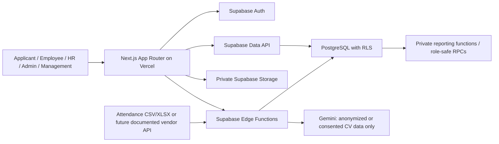

# Architecture

Browser clients use the publishable key and RLS-protected Data API only. Privileged multi-step operations—account invitation, profile approval, AI scoring, and attendance import—run in validated Edge Functions or narrowly scoped database RPCs. Storage buckets are private. The architecture stores normalized attendance logs only; it never stores raw biometric templates or images.
